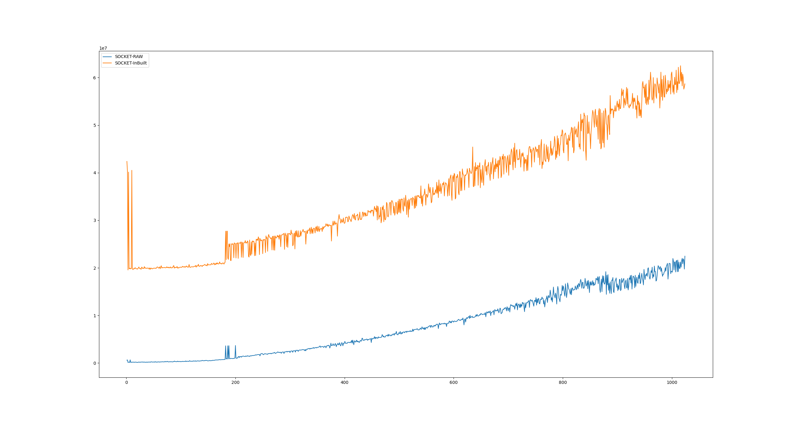
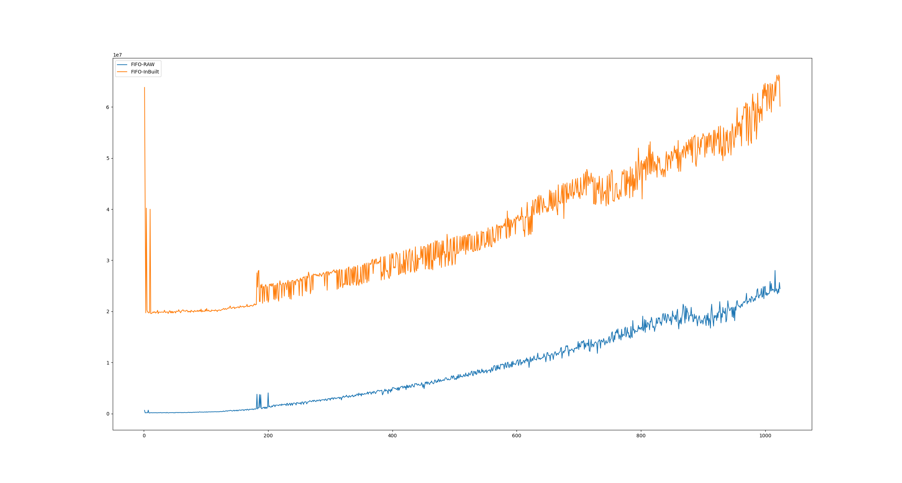
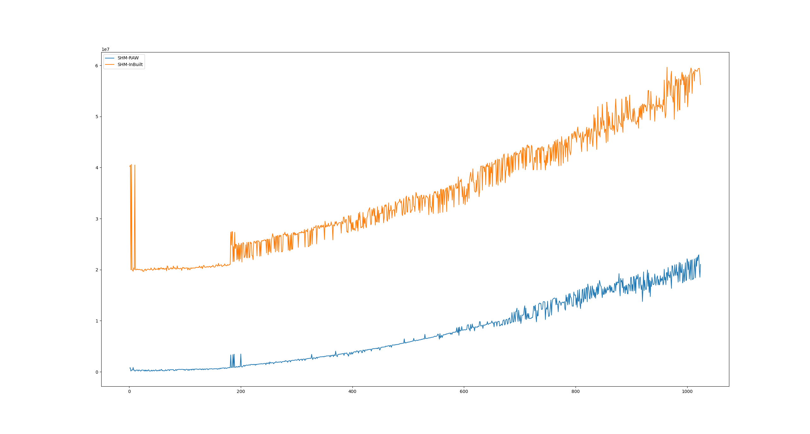
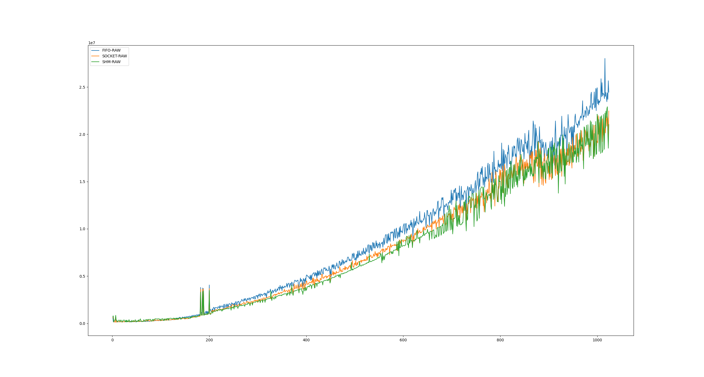

Follow steps on `libtroch page <https://pytorch.org/cppdocs/installing.html>`_ for running the program

Seralizing and Deseralizing
============================

Initially, I did not know how the tensor was arranged in-memory.
Due to this, I went ahead with seralizing and deseralizing using the built-in torch methods.
The seralizing method i.e. torch::save would save the tensor into a string stream and then we would have to get the bytes from the output stream into a buffer.
The deseralizing method i.e. torch::load would load the tensor from string stream and we would have to load the string stream with the buffer.

Approach 1
-----------

Use the in-built methods provided by the pytroch library to convert the tensor to a string stream and then from string stream to a character buffer
The structure of the final buffer looked like

+-------------+------------------+
| Buffer Size | torch::save blob |
+-------------+------------------+ 

This approach is expensive as it saves a ton of metadata.

Approach 2
-----------

This approach is kind of simple and the first thing that comes to mind.
Just send the data, don't send the metadata.
First, we store the number of dimensions. Then we store all those dimensions. Then we store the data.
The final structure of the buffer looks like below

+----------------------+-------------+-------------+-----+-------------+-------------+-----+
| Number of Dimensions | Dimension 1 | Dimension 2 | ... | Data item 1 | Data item 2 | ... |
+----------------------+-------------+-------------+-----+-------------+-------------+-----+

This improved the result by a lot as there was less data to be shared over IPC.

Approach 3
----------

There are 3rd party compression techniques that we can find online on github, I did not try any of those yet.

IPCs
=====

Implemented Unix Sockets, Shared Memory, and FIFO for transfer of data between the programs.

Results
========

The results are as expected

IPC wise comparison. 

We can see that raw data based serialization was much better. This is expected.

.. image:: results/inbuilt.png
   :width: 45%

Here, we see that all 3 IPCs have same performance initially. But as the data size grows, Shared Memory based IPC performs better than the other two. We then have Unix Sockets which perform better than FIFO. 

Hence, I think shared memory based IPC coupled with raw data sharing is the best approach.